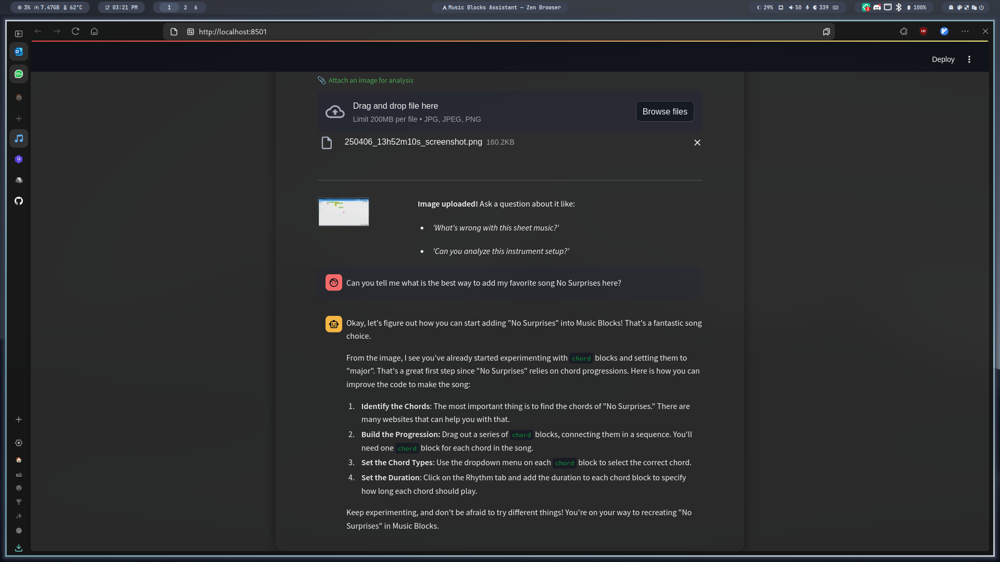

# Music Blocks Assistant 🎵

Music Blocks Assistant is a Streamlit-based chatbot designed to help users learn about music concepts, generate lesson plans, and explore musical topics interactively.

## Features

- **Music Lesson Plans**: Create detailed lesson plans tailored to your needs.
- **Interactive Chat**: Ask questions about music theory, history, or instruments.
- **Image Understanding**: As you can see from this picture:

- **Google Generative AI**: Powered by `google.generativeai` for intelligent responses.

- `guide.md`: Provides context for the assistant.
